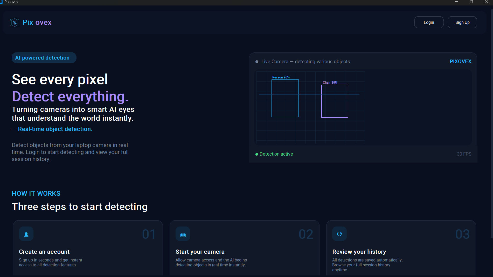
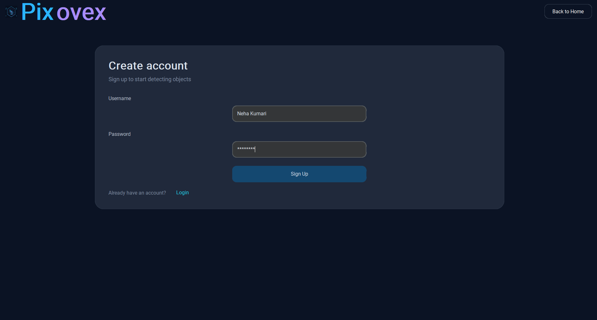
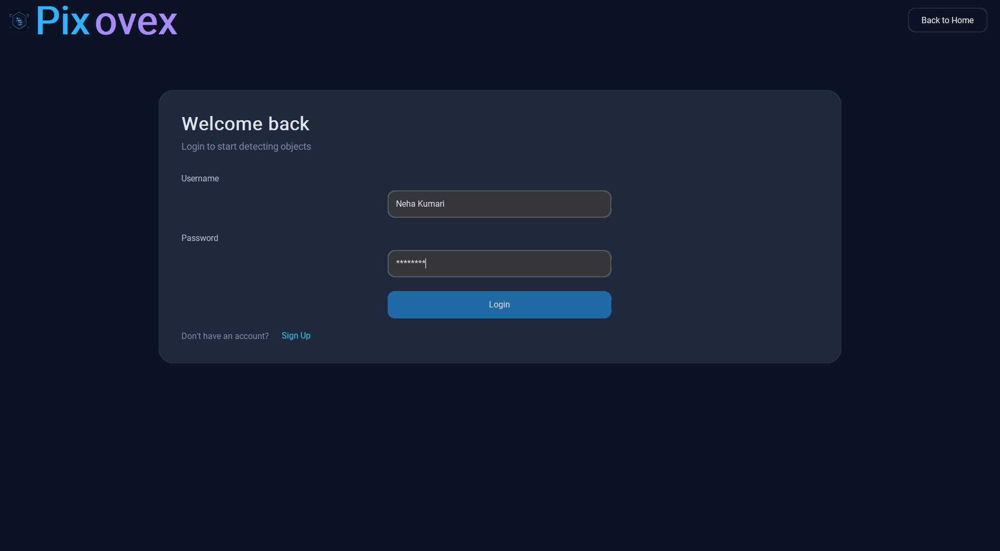
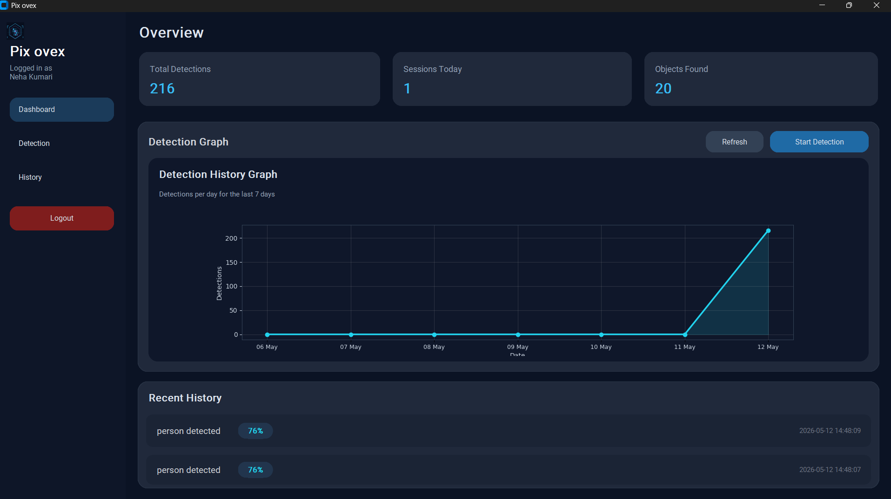
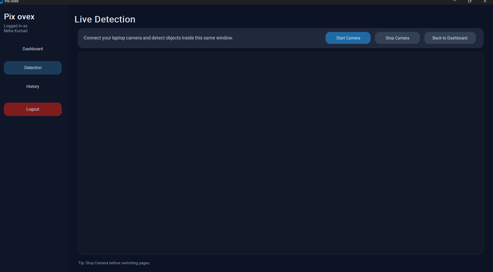
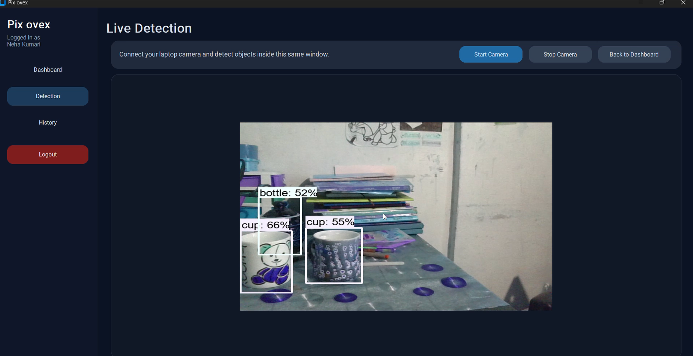
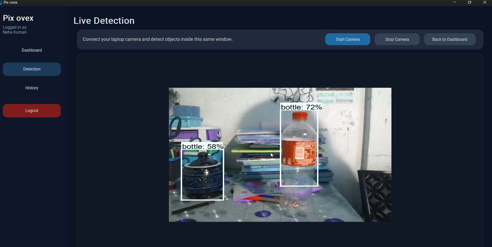

# PIX OVEX – Real-Time Object Detection System

PIX OVEX is an AI-powered Real-Time Object Detection System developed using Python, TensorFlow, OpenCV, and CustomTkinter. The system performs intelligent object recognition through live webcam video streams and provides real-time monitoring using deep learning and computer vision technologies.


# Features

- Real-time object detection using webcam
- TensorFlow deep learning model integration
- Live object bounding boxes and confidence scores
- User authentication system
- Dashboard with detection analytics
- Detection history management
- Modern graphical user interface
- SQLite database integration
- Real-time monitoring and visualization

# Project Screenshots

## Home Page



## Signup Page



## Login Page



## Dashboard



##  Live Detection Page



## Object Detection Output



## Real-Time Detection Result



## Detection History

.png)

# Technologies Used

- Python
- TensorFlow
- OpenCV
- CustomTkinter
- SQLite
- NumPy
- Pillow (PIL)

# System Modules

- Home Page
- Login & Signup Module
- Dashboard Module
- Live Detection Module
- Detection History Module
- Database Management Module
- 
# Installation

## Clone Repository

```bash
git clone https://github.com/Nehakk28/Pix-Ovex---REAL-TIME-OBJECT-DETECTION-.git
```

## Navigate to Project Folder

```bash
cd Pix-Ovex---REAL-TIME-OBJECT-DETECTION-
```

## Create Virtual Environment

```bash
python -m venv venv
```

## Activate Virtual Environment

### Windows

```bash
venv\Scripts\activate
```

## Install Requirements

```bash
pip install -r requirement.txt
```

## Run the Project

```bash
python app.py
```

# Project Workflow

1. User logs into the system  
2. Webcam captures live video frames  
3. OpenCV processes image frames  
4. TensorFlow detects and classifies objects  
5. Bounding boxes and labels are displayed  
6. Detection history is stored in the database  

# Functionalities

- Real-time object recognition
- Detection confidence tracking
- Live monitoring system
- Session analytics dashboard
- Detection history storage
- Secure login system

